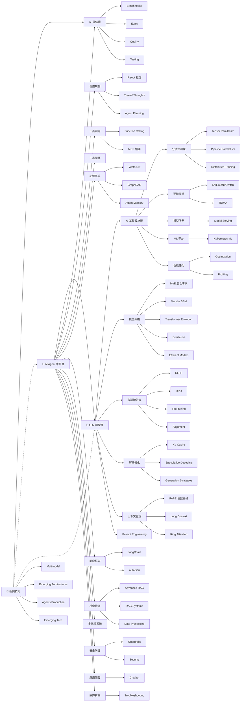

# AI 知識圖譜 🤖🧠⚙️

> 由淺入深的 AI/LLM 學習路徑 | 60+ 主題完整覆蓋 | 深度技術細節全面強化

---

## 知識架構



---

## 📂 檔案結構

```
ai_knowledge/
├── 1_agent/                    # 🤖 應用層 (最易入門)
│   ├── planning/               # 任務規劃
│   │   ├── react.md            # ReAct 推理
│   │   ├── tot.md             # Tree of Thoughts
│   │   └── agent_planning.md  # Agent 規劃系統
│   ├── tool_use/               # 工具調用
│   │   ├── function_calling.md
│   │   └── mcp.md             # Model Context Protocol
│   ├── tools/                  # 工具開發
│   │   └── function_calling.md
│   ├── memory/                 # 記憶系統
│   │   ├── vectordb.md        # 向量資料庫
│   │   ├── graphrag.md        # 知識圖譜 RAG
│   │   └── agent_memory.md    # Agent 記憶系統
│   ├── framework/              # 開發框架
│   │   ├── langchain.md       # LangChain 框架
│   │   └── autoagent.md       # AutoGen 多代理框架
│   ├── rag/                    # 檢索增強生成
│   │   ├── advanced_rag.md    # 高級 RAG 技術
│   │   ├── rag_systems.md    # RAG 系統實作
│   │   └── data_processing.md # RAG 數據處理
│   ├── multi_agent/            # 多代理系統
│   │   └── multi_agent.md
│   ├── safety/                 # 安全防護
│   │   ├── guardrails.md      # AI 安全護欄
│   │   └── security.md        # AI 系統安全
│   ├── applications/           # 應用開發
│   │   └── chatbot.md        # 聊天機器人開發
│   └── debugging/             # 故障排除
│       └── troubleshooting.md # LLM 問題診斷
│
├── 2_llm/                      # 🧠 模型層 (核心知識)
│   ├── architecture/           # 模型架構
│   │   ├── moe.md             # Mixture of Experts
│   │   ├── mamba_ssm.md      # 狀態空間模型
│   │   ├── transformer_evolution.md  # Transformer 演進
│   │   ├── distillation.md   # 模型蒸餾
│   │   └── efficient_models.md # 高效模型設計
│   ├── post_train/             # 後訓練對齊
│   │   ├── rlhf.md            # RLHF 對齊訓練
│   │   ├── dpo.md             # Direct Preference Optimization
│   │   ├── fine_tuning.md     # Fine-tuning 技術
│   │   └── alignment.md       # AI 對齊技術
│   ├── decode_opt/             # 解碼優化
│   │   ├── kv_cache.md        # KV Cache
│   │   ├── speculative_decoding.md  # 投機解碼
│   │   └── generation_strategies.md  # 生成策略
│   ├── context/                # 長上下文
│   │   ├── rope.md            # 旋轉位置編碼
│   │   ├── long_context.md    # 長上下文處理
│   │   └── ring_attention.md  # 環形注意力
│   └── prompt_engineering.md  # 提示工程
│
├── 3_infra/                    # ⚙️ 基礎設施 (最難)
│   ├── distributed/            # 分散式訓練與推論
│   │   ├── tensor_parallelism.md
│   │   ├── pipeline_parallelism.md
│   │   └── training.md         # 分散式訓練
│   ├── hardware/               # 硬體互連
│   │   ├── nvlink_nvswitch.md
│   │   └── rdma.md
│   ├── serving/                # 模型服務部署
│   │   └── model_serving.md
│   ├── platform/               # ML 平台
│   │   └── kubernetes_ml.md   # Kubernetes for ML
│   └── performance/             # 性能優化
│       ├── optimization.md    # 性能優化
│       └── profiling.md       # 性能分析
│
├── 4_eval/                     # 📊 評估與測試
│   ├── benchmarks.md           # 評估基準
│   ├── evals.md               # 評估方法
│   ├── quality.md             # 質量保證
│   └── testing.md             # 測試策略
│
├── 5_emerging/                 # 🚀 新興技術
│   ├── multimodal.md          # 多模態模型
│   ├── emerging_architectures.md  # 新興架構
│   ├── agents_production.md   # 生產級 Agent
│   └── emerging_tech.md        # 新興技術趨勢
│
└── LEARNING_PATH.md            # 學習路徑指南
```

---

## 📊 知識庫統計

| 類別 | 主題數 | 難度範圍 |
|:---:|:---:|:---:|
| 🤖 Agent 應用層 | 20+ | ⭐-⭐⭐ |
| 🧠 LLM 模型層 | 14+ | ⭐⭐-⭐⭐⭐ |
| ⚙️ 基礎設施 | 10+ | ⭐⭐⭐-⭐⭐⭐⭐⭐ |
| 📊 評估測試 | 4 | ⭐⭐-⭐⭐⭐ |
| 🚀 新興技術 | 4 | ⭐⭐⭐-⭐⭐⭐⭐ |
| **總計** | **60+** | - |

---

## 🎯 快速開始

| 程度 | 建議起點 | 目標主題 |
|:---:|----------|----------|
| 初學者 | `1_agent/tool_use/function_calling.md` | Function Calling → VectorDB → LangChain |
| 进阶者 | `2_llm/decode_opt/kv_cache.md` | KV Cache → RLHF → RoPE |
| 專家 | `3_infra/hardware/rdma.md` | Ring Attention → Tensor Parallelism → RDMA |

---

## 🔗 核心知識關聯

```
應用層 → 模型層 → 基礎設施
   │         │
   ├── Function Calling ──▶ MCP
   ├── VectorDB ──▶ ReAct ──▶ ToT
   ├── LangChain ──▶ AutoGen ──▶ Multi-Agent
   └── GraphRAG ──▶ Advanced RAG

模型層核心鏈:
   Prompt Eng → RLHF → DPO → Alignment
   Fine-tuning → Distillation → Efficient Models
   KV Cache ◀── Speculative Decoding
   RoPE → Long Context → Ring Attention
   MoE / Mamba → Transformer Evolution

基礎設施支撐:
   Ring Attention → Pipeline Parallelism → Tensor Parallelism
        │                    │
        └────────────────────┼──▶ Distributed Training
                             │
                             ├──▶ NVLink/NVSwitch
                             │
                             └──▶ RDMA
```

---

*學習路徑詳見 [LEARNING_PATH.md](./LEARNING_PATH.md)*